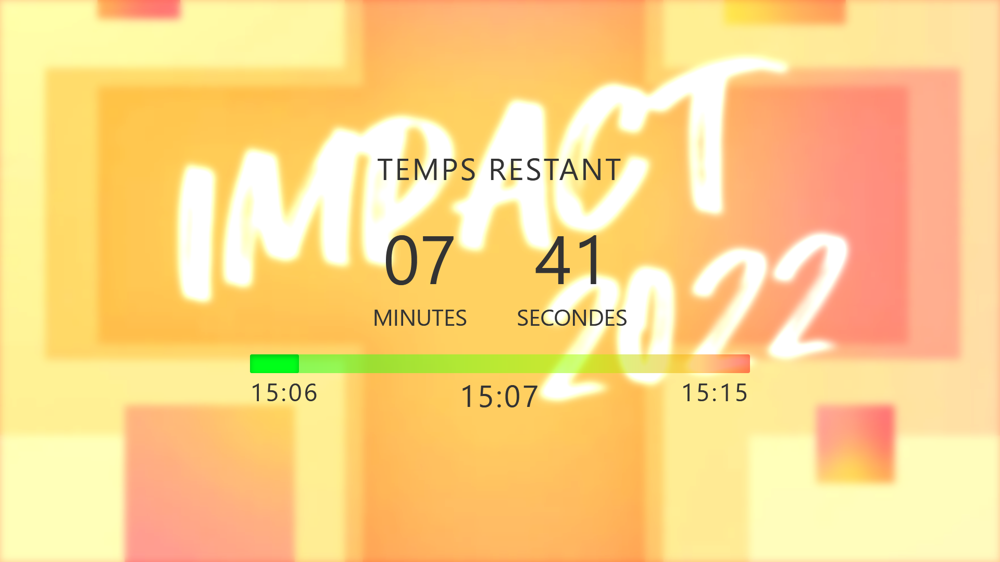
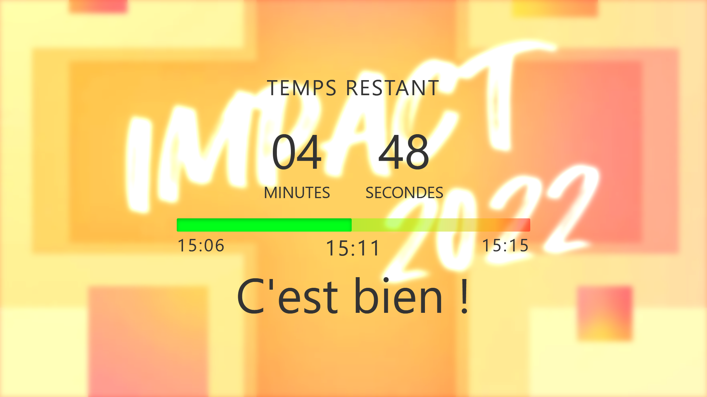
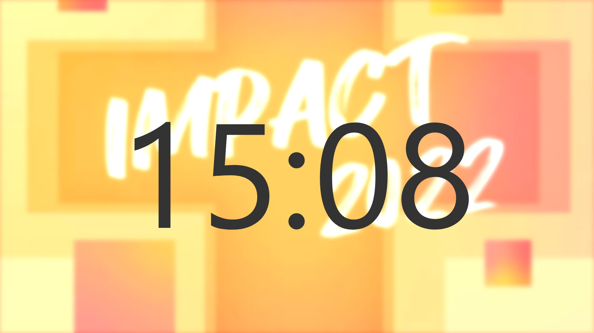
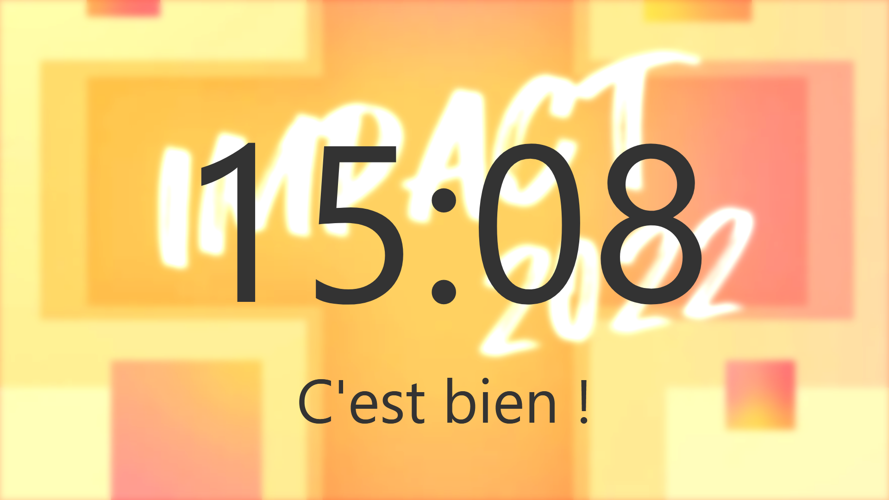
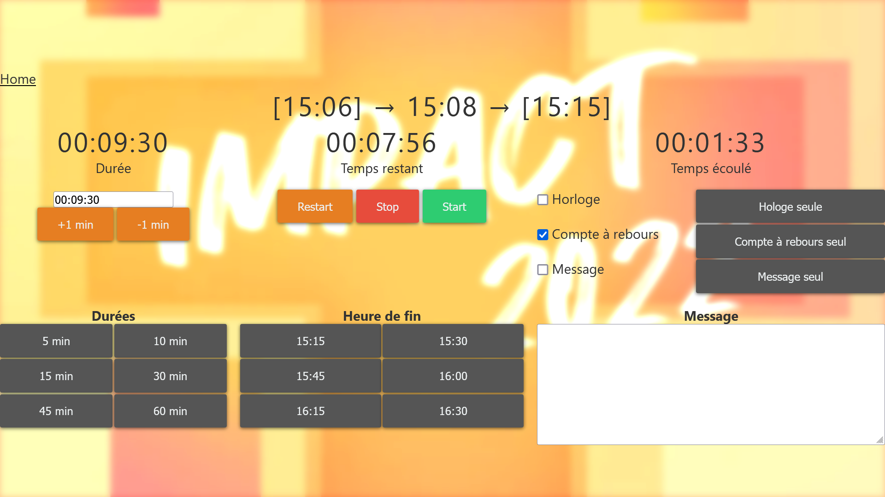
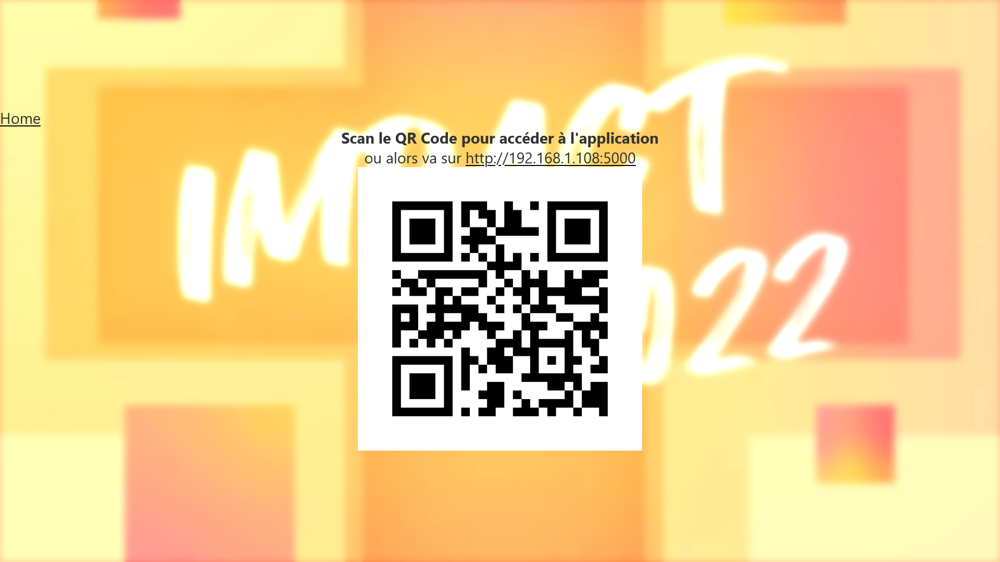

# Countdown
Web-based remote controlled countdown in .Net C#

## Overview
### Presenter view

Countdown

Countdown + Message

Clock

Clock + Message


### Control
Control the presenter view from a remote page.


### Remote access information
Display the local IP and a QR code to access the Countdown easily from a smartphone.


## Development
### Requirements

- .NET 6
- Visual Studio Code or Visual Studio 2022

Download the latest version of the .NET framework for your system from here
https://dotnet.microsoft.com/download/dotnet/6.0

## Setup on a Raspberry Pi

Install .NET 6 SDK
``` bash 
cd ~
wget https://dotnet.microsoft.com/download/dotnet/scripts/v1/dotnet-install.sh
chmod +x dotnet-install.sh
./dotnet-install.sh -c 6.0
```

Add `dotnet` to PATH
``` bash
echo 'export DOTNET_ROOT=$HOME/.dotnet' >> ~/.bashrc
echo 'export PATH=$PATH:$HOME/.dotnet' >> ~/.bashrc
source ~/.bashrc
dotnet --version
```
The output shall be something like `6.0.200`

``` bash 
git clone https://github.com/FabriceMaillefer/Countdown.git
cd Countdown

dotnet run --urls=http://+:5000/
```

Edit the `countdown.service` file to change the absolute path in `WorkingDirectory` and `ExecStart`
```bash
nano ~/Countdown/Docs/RaspberryPi/countdown.service
```

Enable the service for automatic start
```bash
chmod +x Docs/RaspberryPi/run.sh
sudo systemctl enable ~/Countdown/Docs/RaspberryPi/countdown.service 
```

### Tips:

If you modify the  `countdown.service` file after registration, use `sudo systemctl daemon-reload` to reload the service.

Check service status:
```bash
sudo service countdown status
```
Check service output:
```bash
sudo journalctl -u countdown -e
```

## License
Countdown is distributed under the MIT License.